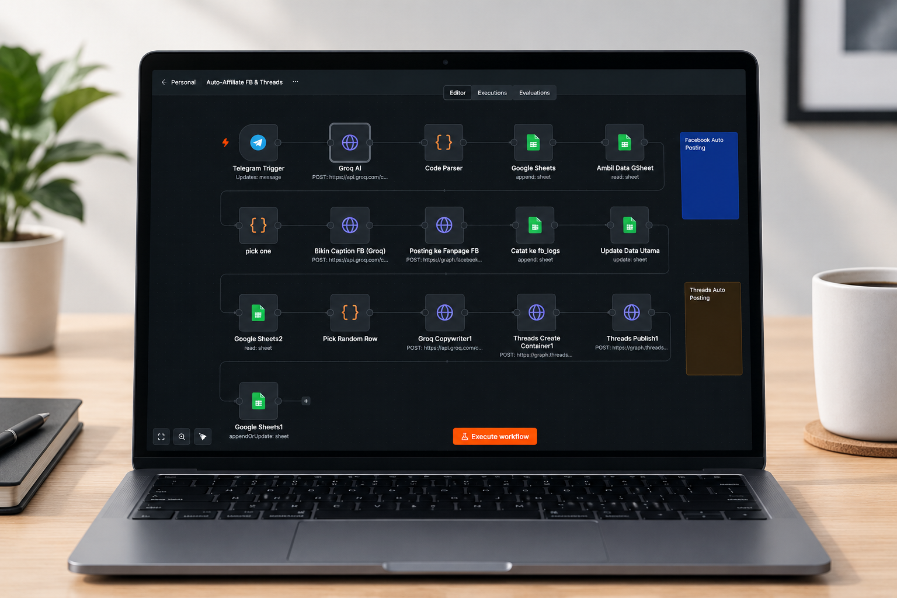

# 🚀 Telegram to Social Media Auto-Poster & Logger

## 📌 Overview
Managing multiple social media accounts manually is time-consuming. This automation workflow listens to a specific Telegram channel/chat, processes the incoming message, and automatically broadcasts it to **Facebook Pages** and **Threads**. Finally, it logs the success/failure status and timestamp into a **Google Sheet** for tracking and analytics.

## 🛠️ Tech Stack & Integrations
- **Core Engine:** n8n (Node-based workflow automation)
- **Trigger:** Telegram Bot API
- **Action/Destinations:** Facebook Graph API, Threads API
- **Database/Logging:** Google Sheets API

## ✨ Features
- **Instant Cross-Posting:** Send a message in Telegram, and it goes live everywhere.
- **Centralized Logging:** Keeps a clean record in Google Sheets (Date, Platform, Message snippet, Status).

## 📸 Workflow Preview

.

## 🚀 How to Use / Import
Want to use this workflow? 
1. Install [n8n](https://n8n.io/).
2. Download the `workflow.json` file from this repository.
3. In your n8n dashboard, click **Import from File** and select the JSON file.
4. Update the Credentials (Telegram Bot Token, Facebook Access Token, Google Service Account).
5. Activate the workflow!

---
**Author:** Andre Nurdiansyah - Connect with me on 
